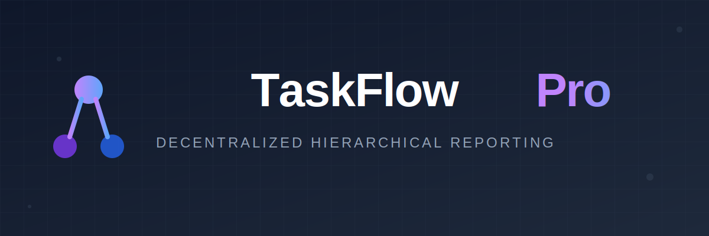

<div align="center">
  
  <h1>TaskFlow Pro</h1>
  
  <p>
    <strong>Redefining team collaboration with a decentralized hierarchical reporting network.</strong>
  </p>

  

  <p align="center">
    <a href="https://www.typescriptlang.org/">
      
    </a>
    <a href="https://reactjs.org/">
      
    </a>
    <a href="https://tailwindcss.com/">
      
    </a>
    <a href="https://peerjs.com/">
      
    </a>
    <a href="https://vitejs.dev/">
      
    </a>
  </p>
  
  <p>
    <a href="README.md">中文文档</a>
  </p>
</div>

## 📖 Introduction

**TaskFlow Pro** is a modern distributed task management system built on WebRTC technology. It breaks the limitations of traditional centralized collaboration by using P2P technology for real-time data synchronization and privacy protection.

Unlike ordinary Todo apps, TaskFlow Pro introduces a unique **"Hierarchical Reporting System"**. By generating a unique reporting ID, you can easily build multi-level reporting relationships (e.g., A → B → C). Subordinates' task statuses are automatically synchronized to their superiors' view in real-time, ensuring seamless information flow and efficient management.

## ✨ Key Features

- **🔗 Distributed Hierarchical Reporting**
  Supports reporting relationships of any depth (e.g., Employee → Manager → Director). Data is transmitted transparently via P2P networks, allowing superiors to stay updated on team progress instantly.

- **🛡️ Privacy First & Data Security**
  Based on PeerJS point-to-point communication, data is stored locally (LocalStorage) and does not pass through any centralized database, ensuring the absolute security of your business secrets and personal privacy.

- **⚡ Real-time Two-way Sync**
  Adopts a Mesh/Tree hybrid topology where updates from any node are synchronized to associated reporting targets in milliseconds with zero latency.

- **🎨 Ultimate UI/UX Experience**
  Modern interface built with Tailwind CSS, featuring Glassmorphism effects, smooth transitions, and responsive design, perfectly adapted for both desktop and mobile.

- **📊 Smart Weekly Reports**
  Built-in weekly report generator that summarizes work content, completion status, and statistics with one click. Supports Markdown export to significantly improve reporting efficiency.

- **📱 Scan to Connect**
  No complex configuration required. Establish reporting connections quickly by scanning a QR code or entering a short ID.

## 🚀 Quick Start

### Prerequisites

- Node.js 16.0 or higher
- npm or yarn

### Installation

```bash
# Clone the repository
git clone https://github.com/your-username/taskflow-pro.git

# Navigate to the directory
cd taskflow-pro

# Install dependencies
npm install
```

### Development

```bash
npm run dev
```

Visit `http://localhost:5173` in your browser to start using the application.

## 🛠️ Tech Stack

- **Core Framework**: React 18 + TypeScript
- **Build Tool**: Vite 5
- **Styling**: Tailwind CSS + Lucide React Icons
- **Communication**: PeerJS (WebRTC)
- **State Management**: React Context + Hooks
- **Utilities**: date-fns, clsx, tailwind-merge

## 💡 User Guide

1.  **Create Tasks**: Enter task details, set priority, and due date in the main interface.
2.  **Establish Reporting Relationship**:
    *   **As a Manager**: Click **"Receive Report"** in the top right corner to get your unique ID or QR code.
    *   **As a Subordinate**: Click **"Connect to Manager"** in the top right corner and enter the manager's ID.
3.  **Start Collaborating**: Once connected, the subordinate's task list will automatically sync to the manager's view, with real-time updates for any changes.

## 📄 License

This project is licensed under the MIT License.
